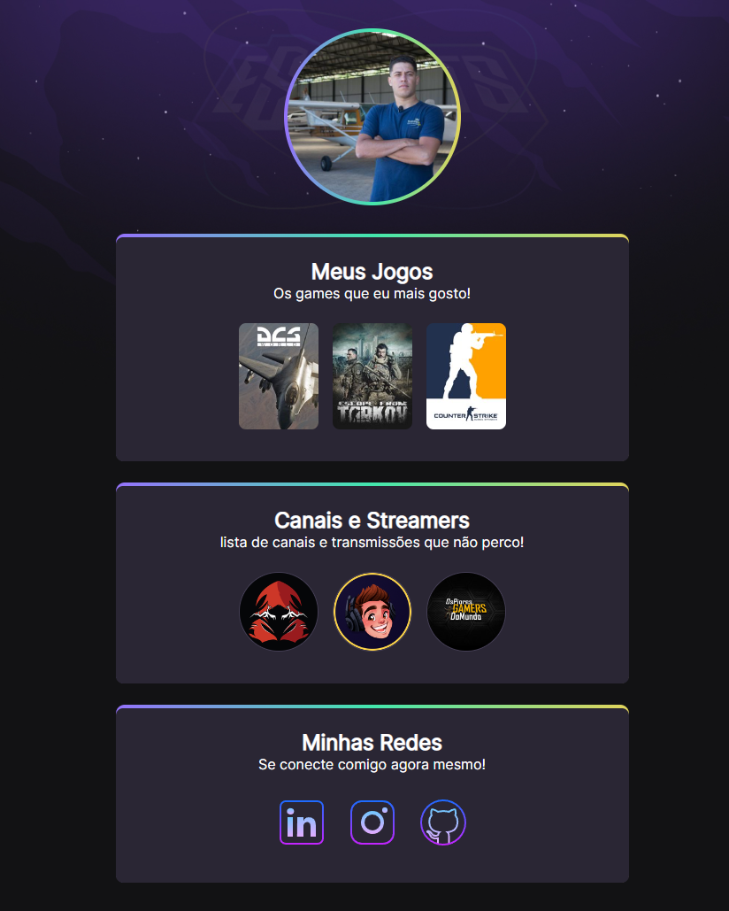

<h1 align="center">
   NLW eSports
</h1>

## 💻 Projeto

📦Projeto desenvolvido no evento da **NLW eSports** na _Trilha Explorer_.

> **Link do projeto:** [🔗Clique aqui para acessar](https://luanfreiitas.github.io/NLW/)

###

**✏️Linguagens:**

- [HTML5](https://developer.mozilla.org/pt-BR/docs/Web/HTML)
- [CSS3](https://developer.mozilla.org/pt-BR/docs/Web/CSS)

**🚀Tecnologias:**

- [Visual Studio Code](https://code.visualstudio.com)
- [Git](https://git-scm.com) | [GitHub](https://github.com)
- [Figma](https://www.figma.com)